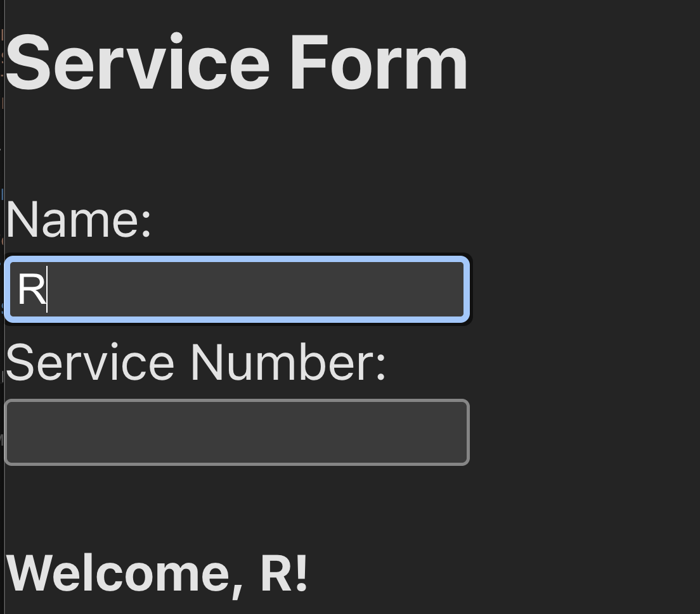

# Form Storage Lab

This is a simple react app (to practice custom hooks and package management) it’s a service form that saves your name and service number in local storage so your input sticks around even if you refresh the page.
---
## Table of Contents

- [Demo](#demo)
- [Setup](#️setup)
- [Testing](#testing)
- [Features](#features)

---

## Demo

---

## Setup

1. Fork and clone the repo.
2. Install dependencies: `npm install`
3. Run `npm run dev` to start the dev server and follow link in browser

## Testing

- To run the tests: `npm run test`

## Features
- Custom hook (useLocalStorage) for syncing state with localStorage
- Form inputs for name and service number
- Data persists when there's page refreshes
